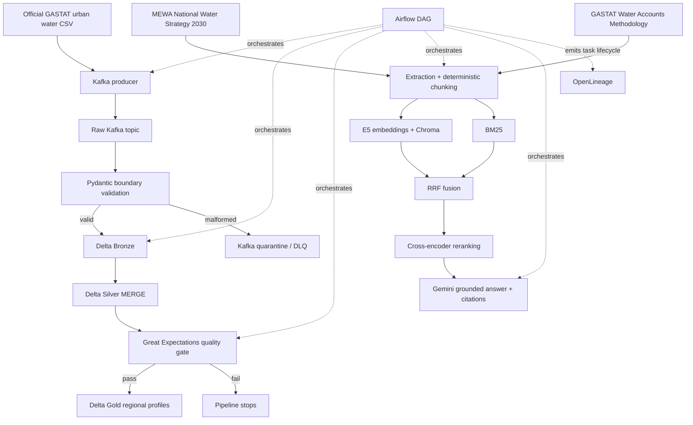

# AquaLens 2030

### Saudi Urban Water Source Intelligence Platform

[](https://colab.research.google.com/github/98raneemsaif-create/aqualens-2030/blob/main/notebooks/aqualens_2030_colab_demo.ipynb)

AquaLens 2030 is an end-to-end Data Engineering capstone that turns official Saudi urban water-distribution data into reliable regional water-source concentration profiles, then complements those observations with grounded context from official Saudi water-strategy and methodology documents.

The project deliberately separates two questions:

- **Lakehouse analytics:** What does the data show?
- **Grounded RAG:** What strategic or methodological context do official Saudi sources provide?

Water-source concentration is descriptive. AquaLens does **not** invent water-risk labels, thresholds, forecasts, or anomaly scores.

> **Fastest review path:** open the Colab notebook above. It runs the portable project components directly in Google Colab and reads the committed full-runtime outputs for Kafka, Airflow, and OpenLineage.

---

## What the project demonstrates

AquaLens integrates the five scored capstone areas into one working pipeline:

- **Streaming ingestion:** Apache Kafka producer/consumer with Pydantic validation and a real quarantine topic.
- **Delta Lakehouse:** Bronze, Silver, and Gold Delta tables, including a real Silver `MERGE` on `year + region + source` and an actual rejected schema write.
- **Data quality:** Great Expectations validation that blocks downstream processing when Silver data fails.
- **Orchestration and lineage:** an Apache Airflow DAG covering the complete pipeline, with OpenLineage `START`, `COMPLETE`, and `FAIL` events.
- **Hybrid RAG:** multilingual dense retrieval + BM25 + RRF + cross-encoder reranking + grounded Gemini generation with source/page citations.

The project uses real libraries throughout; Kafka, Airflow, Delta Lake, Chroma, Great Expectations, and OpenLineage are not simulated.

---

## Architecture



The Lakehouse and RAG paths are complementary: Gold contains analytical observations, while the RAG answer is grounded only in retrieved official-document context. See [docs/architecture.md](docs/architecture.md) for the detailed data flow, modules, and failure behavior.

---

## Data and official sources

### Analytical dataset

Core dataset:

**Water Distribution in Urban Sector by Source – Annual**

- Publisher: **General Authority for Statistics (GASTAT)**
- Accessed through: **DataSaudi**
- Local immutable snapshot: `data/source/water_distribution_urban_saudi.csv`
- Year: **2024**
- Rows: **56**
- Geography: **13 Saudi regions + Grand Total**
- Water-source categories: **4**
- Business key: `year + region + source`
- Source SHA-256: `4df640b65d3341c1e42e64be7582434aa5e19ceabfa952feb35195f8350a849c`

The source snapshot is not rewritten by the pipeline. Deliberately invalid records live only in isolated test fixtures.

### RAG knowledge base

The core RAG corpus is restricted to two official Saudi government documents:

1. **National Water Strategy 2030** — Ministry of Environment, Water and Agriculture (MEWA)
2. **Methodology and Quality Report of Water Accounts** — General Authority for Statistics (GASTAT)

Final corpus: **445 deterministic chunks**

- MEWA: 391
- GASTAT: 54

Source metadata, canonical URLs, retrieval timestamps, and hashes are preserved under `rag/sources/`.

---

## Lakehouse model

### Bronze

Append-only Delta storage of accepted ingestion events. `Grand Total` and valid zero-volume observations are retained.

### Silver

Normalized Delta table with a real `MERGE` keyed on:

```text
year + region + source
```

Replaying the same 56 source records leaves Silver at 56 unique business keys.

### Gold

Gold excludes `Grand Total` and produces **13 regional profiles**:

| Column                      | Meaning                                         |
| --------------------------- | ----------------------------------------------- |
| `year`                      | Observation year                                |
| `region`                    | Saudi region                                    |
| `total_water_volume_m3`     | Sum of all source volumes in the region         |
| `dominant_source`           | Largest source by volume                        |
| `dominant_source_volume_m3` | Dominant-source volume                          |
| `dominant_source_share_pct` | Dominant-source share of regional total         |
| `active_source_count`       | Number of sources with volume greater than zero |

Example outputs from the verified Delta run:

| Region         | Total water volume (m³) | Dominant source          | Dominant share | Active sources |
| -------------- | ----------------------: | ------------------------ | -------------: | -------------: |
| Al-Riyadh      |           1,169,478,459 | Desalinated water (SWCC) |         70.63% |              2 |
| Eastern Region |             667,705,791 | Desalinated water (SWCC) |         76.91% |              2 |
| Al-Jouf        |              49,568,883 | Groundwater              |        100.00% |              1 |

The supplied source totals are preserved as-is. Regional sums differ from the supplied Grand Total by **-1 m³** for Desalinated water and **-1 m³** for Surface water; Groundwater and Other Sources reconcile exactly. No cause is invented for those source-level discrepancies.

---

## Hybrid RAG design

The retrieval pipeline uses:

- Embeddings: `intfloat/multilingual-e5-small`
- Vector store: ChromaDB `PersistentClient`
- Dense retrieval: top 8
- Keyword retrieval: `BM25Okapi`, top 8
- Fusion: Reciprocal Rank Fusion, `k=60`
- Reranker: `cross-encoder/mmarco-mMiniLMv2-L12-H384-v1`
- Final evidence context: top 4 reranked chunks
- Generation: `gemini-3.5-flash`, temperature `0`

Gemini 3.5 Flash is the explicitly approved runtime fallback used after the originally planned Gemini 2.5 Flash request returned HTTP 404. The retrieval architecture and grounding contract were unchanged.

Generation is constrained to the retrieved official context. Answers cite the resolved document title, physical PDF page, and official URL. An unsupported query returns an insufficient-evidence response rather than inventing an answer.

The verified Airflow smoke answer resolved three citations to the MEWA strategy (physical pages 13, 63, and 69).

---

## Airflow pipeline

DAG:

```text
aqualens_2030_pipeline
```

Task order:

```text
produce_events
→ consume_and_validate
→ bronze_load
→ silver_merge
→ schema_enforcement_proof
→ quality_gate
→ gold_build
→ rag_chunk_and_index
→ rag_grounded_answer_smoke_test
```

The default dependency behavior is intentional: if `quality_gate` fails, Gold and RAG do not execute.

Verified full success run:

```text
phase_e_success
```

All nine tasks completed successfully.

Verified controlled quality-failure run:

```text
phase_e_quality_failure
```

Observed result:

```text
produce_events                 success
consume_and_validate           success
bronze_load                    success
silver_merge                   success
schema_enforcement_proof       success
quality_gate                   failed
gold_build                     upstream_failed
rag_chunk_and_index            upstream_failed
rag_grounded_answer_smoke_test upstream_failed
```

The failed DAG state is expected for this demonstration: the negative numeric fixture passes structural Pydantic validation, reaches Silver, and is rejected by the Great Expectations nonnegative-volume rule.

---

## Quick start — full local runtime

### Prerequisites

- Docker Desktop using Linux containers / WSL 2 on Windows, or a compatible Docker Engine environment
- Docker Compose
- Git
- Sufficient disk and memory for the Airflow runtime and local model caches
- Internet access for the initial image/model downloads
- A Gemini API key **only if you want to execute live grounded generation**

The project runtime is Python 3.11 inside the Airflow image. You do not need a separate host Python installation for the Docker path.

### 1. Clone

```bash
git clone https://github.com/98raneemsaif-create/aqualens-2030.git
cd aqualens-2030
```

### 2. Optional environment file

Create a local `.env` from the committed example.

PowerShell:

```powershell
Copy-Item .env.example .env
```

Bash / zsh:

```bash
cp .env.example .env
```

For a full success DAG run, set:

```text
GEMINI_API_KEY=your_private_key_here
```

Never commit `.env` or an API key.

### 3. Build and start

```bash
docker compose build airflow
docker compose up -d --wait --wait-timeout 300
docker compose ps
```

Expected: both `kafka` and `airflow` are healthy.

Airflow web UI (default):

```text
http://localhost:8080
```

Kafka host endpoint (default):

```text
localhost:9092
```

Internal container endpoint:

```text
kafka:29092
```

### 4. Trigger the pipeline

Unpause the DAG if needed:

```bash
docker compose exec -T airflow airflow dags unpause aqualens_2030_pipeline
```

Trigger a normal run:

```bash
docker compose exec -T airflow airflow dags trigger aqualens_2030_pipeline
```

Use the Airflow UI to monitor the run. To inspect a known run ID from the terminal:

```bash
docker compose exec -T airflow airflow tasks states-for-dag-run aqualens_2030_pipeline <RUN_ID>
docker compose exec -T airflow airflow dags state aqualens_2030_pipeline <RUN_ID>
```

### 5. Controlled quality-failure demo

From the Airflow UI, trigger `aqualens_2030_pipeline` with:

```json
{ "quality_failure_demo": true }
```

Expected behavior: `quality_gate` fails and the three downstream output-producing tasks become `upstream_failed`.

### 6. Stop

```bash
docker compose stop
```

or remove containers/network while retaining named volumes:

```bash
docker compose down
```

Avoid `docker compose down --volumes` unless you intentionally want to erase local runtime data.

---

## Quick start — Google Colab

For a faster walkthrough without local Docker, open:

**[notebooks/aqualens_2030_colab_demo.ipynb](notebooks/aqualens_2030_colab_demo.ipynb)**

The notebook has been run successfully in Google Colab. It executes the portable project components directly:

- official dataset checks
- Pydantic validation
- Delta Bronze / Silver / Gold
- real Delta MERGE and schema rejection
- Great Expectations pass/fail behavior
- hybrid retrieval
- optional Gemini generation

Kafka, Airflow, and OpenLineage remain full-runtime components; the notebook displays their committed real execution outputs instead of replacing them with mocks.

---

## Expected project outputs

| Component             | Expected / verified result                                 |
| --------------------- | ---------------------------------------------------------- |
| Official source       | 56 rows                                                    |
| Kafka Phase B proof   | 57 produced = 56 official + 1 malformed fixture            |
| Pydantic/Kafka result | 56 accepted, 1 quarantined                                 |
| Bronze                | 56 rows                                                    |
| Silver                | 56 unique business-key rows after replay                   |
| Gold                  | 13 regional profiles                                       |
| RAG corpus            | 445 chunks                                                 |
| Success DAG           | 9/9 tasks successful                                       |
| Quality failure demo  | GX fails on one `-1.0`; Gold/RAG blocked                   |
| OpenLineage           | START / COMPLETE / FAIL captured from real task executions |

Detailed reproducible evidence is retained under `docs/evidence/`.

---

## Configuration

User-facing settings are documented in [docs/configuration.md](docs/configuration.md).

The most important values are:

| Setting                     | Default                        | Purpose                   |
| --------------------------- | ------------------------------ | ------------------------- |
| `AIRFLOW_PORT`              | `8080`                         | Host Airflow UI port      |
| `KAFKA_HOST_PORT`           | `9092`                         | Host Kafka debugging port |
| `GEMINI_API_KEY`            | empty                          | Live grounded generation  |
| `KAFKA_BOOTSTRAP_SERVERS`   | `kafka:29092`                  | Internal Kafka endpoint   |
| `KAFKA_RAW_TOPIC`           | `aqualens.water.raw.v1`        | Raw topic                 |
| `KAFKA_QUARANTINE_TOPIC`    | `aqualens.water.quarantine.v1` | DLQ/quarantine topic      |
| `INGESTION_TIMEOUT_SECONDS` | `60`                           | Bounded ingestion timeout |

Secrets belong in `.env` or the runtime environment and must never be committed.

---

## Repository structure

```text
aqualens-2030/
├── dags/                  # Airflow DAG
├── data/source/           # Immutable analytical CSV
├── docs/                  # Technical docs, phase reports, rubric, evidence
├── notebooks/             # Colab technical walkthrough
├── rag/sources/           # Official Saudi RAG snapshots + metadata
├── requirements/          # Frozen Python 3.11 runtime
├── src/
│   ├── common/            # Shared configuration
│   ├── ingestion/         # Kafka + Pydantic + quarantine
│   ├── lakehouse/         # Bronze / Silver / Gold / schema proof
│   ├── quality/           # Great Expectations gate
│   └── rag/               # Chunking / retrieval / reranking / generation
├── tests/                 # Unit/integration proofs and failure fixtures
├── Dockerfile
├── docker-compose.yml
└── README.md
```

Generated Delta tables, Chroma data, model caches, local Airflow data, and secrets are excluded from Git. Curated execution evidence is committed under `docs/evidence/`.

---

## Evidence and technical documentation

- [Architecture](docs/architecture.md)
- [Configuration](docs/configuration.md)
- [Rubric matrix](docs/rubric_matrix.md)
- [Phase A report](docs/phase_a_report.md)
- [Phase B report](docs/phase_b_report.md)
- [Phase C report](docs/phase_c_report.md)
- [Phase D report](docs/phase_d_report.md)
- [Phase E report](docs/phase_e_report.md)
- [Execution evidence](docs/evidence/)

The repository preserves both successful and intentionally failing execution paths. Historical Gemini availability failures are retained rather than removed.

---

## Scope and limitations

AquaLens is a capstone / production-simulated local data platform, not a production Saudi water-management service.

Current boundaries:

- analytical snapshot is 2024 only;
- no forecasting, anomaly detection, or invented water-risk classification;
- RAG is restricted to the two approved official Saudi documents;
- MEWA RAG chunks use verified narrative text and exclude unreliable table/numeric extraction;
- Gemini is an external dependency and can be temporarily unavailable;
- local Docker uses a single Kafka broker and Airflow LocalExecutor for a compact reproducible capstone runtime.

These limits are intentional and keep claims aligned with the evidence.

---

## Training program

This capstone was completed under:

- **Program:** Modern Data Engineering for AI Systems
- **Provider:** [SDAIA Academy](https://github.com/SDAIAAcademy)
- **Delivery:** Learning Space
- **Cohort/session dates:** 06 September 2026 – 10 September 2026

---

## Author

**Raneem Saif Aldawsari**<br>
Data Engineer<br>
GitHub: [98raneemsaif-create](https://github.com/98raneemsaif-create)
