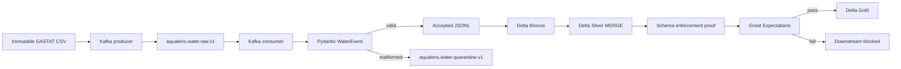
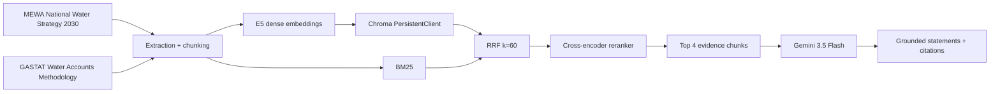
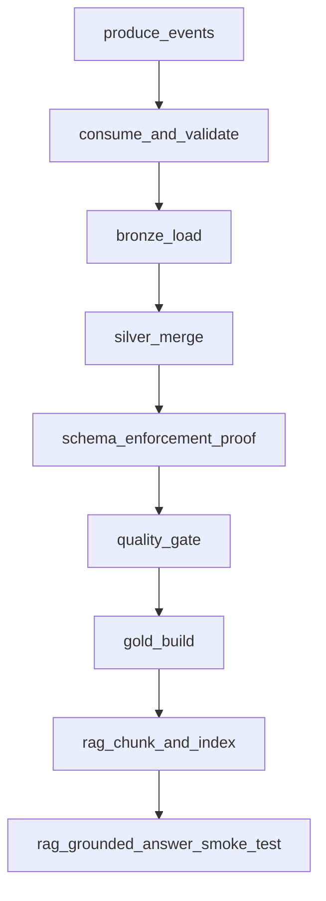

# AquaLens 2030 — Architecture

## 1. Purpose

AquaLens 2030 is a compact, production-simulated Data Engineering platform for analyzing the composition of Saudi urban water distribution by source and providing official strategic/methodological context through Hybrid RAG.

The architecture is intentionally separated into:

1. an **analytical data path** that produces regional water-source concentration profiles; and
2. an **official-document context path** that produces grounded answers with citations.

Gold analytical values are not silently injected into the RAG prompt. This preserves a clear boundary between observed data and official strategic interpretation.

---

## 2. Runtime topology

The local runtime has only two Docker Compose services:

| Service | Runtime | Responsibility |
|---|---|---|
| `kafka` | Apache Kafka 4.2.1, single-node KRaft | Raw ingestion and quarantine/DLQ topics |
| `airflow` | Apache Airflow 3.3.1 on Python 3.11 | Application runtime, orchestration, quality gate, Delta, RAG, lineage |

Airflow uses:

- `LocalExecutor`
- SQLite metadatabase with WAL-compatible local runtime storage
- maximum pipeline parallelism intentionally constrained for the local capstone
- OpenLineage Airflow Provider with FileTransport
- CPU-only PyTorch runtime
- mounted project source code and evidence paths

Generated Delta, Chroma, and model-cache files live under gitignored `storage/`.

---

## 3. End-to-end analytical path



### Ingestion contract

Source mapping:

| Source CSV | Internal event |
|---|---|
| `Year` | `year` |
| `Province` | `region` |
| `Source` | `source` |
| `Value` | `volume_m3` |

Business key:

```text
year + region + source
```

Pydantic owns **structural/type validation**. A numeric negative value is structurally valid so the downstream business-quality layer can demonstrate the distinction between schema validation and data-quality validation.

Malformed values such as `"not-a-number"` are routed to Kafka quarantine with the original payload and `rejection_reason`.

---

## 4. Delta Lakehouse

### Bronze

`src/lakehouse/bronze.py`

- real Delta table using `deltalake`;
- append-only configuration;
- preserves all accepted events;
- retains `Grand Total`;
- retains valid zero-volume rows.

### Silver

`src/lakehouse/silver.py`

- normalized business records;
- real Delta `MERGE`;
- key: `year + region + source`;
- repeated source input is idempotent at the business-key level.

### Schema enforcement

`src/lakehouse/schema_proof.py`

An isolated Delta table receives a deliberately incompatible value. The real write is refused; version, count, and schema remain unchanged.

### Gold

`src/lakehouse/gold.py`

Gold excludes `Grand Total` and aggregates the 52 regional source rows into 13 regional profiles:

```text
year
region
total_water_volume_m3
dominant_source
dominant_source_volume_m3
dominant_source_share_pct
active_source_count
```

`active_source_count` counts source categories with `volume_m3 > 0`.

---

## 5. Quality gate

`src/quality/gate.py`

Great Expectations validates Silver before Gold.

Key checks include:

- required values;
- business-key uniqueness;
- nonnegative `volume_m3`.

A failed validation raises the project quality exception, causing the Airflow `quality_gate` task to fail.

The controlled failure fixture:

```text
tests/fixtures/negative_water_event.json
```

contains a numeric `volume_m3 = -1`. It is intentionally accepted by Pydantic, reaches Silver, and is rejected by Great Expectations.

This proves that business-quality validation is performed by the real quality layer rather than being hidden inside schema parsing.

---

## 6. Hybrid RAG path



### Source extraction

- **MEWA:** PyMuPDF 1.28.2 default unsorted narrative extraction. Alternative sorted/layout modes were rejected because they damaged Arabic reading order. Unreliable table/numeric fragments are excluded from the MEWA RAG corpus.
- **GASTAT:** pypdf 6.17.0 plain extraction.

Final corpus:

```text
445 chunks = 391 MEWA + 54 GASTAT
```

### Retrieval

`src/rag/retrieval.py`

- model: `intfloat/multilingual-e5-small`
- normalized 384-dimensional embeddings
- Chroma collection: `aqualens_official_docs`
- dense top 8
- BM25 top 8
- RRF `k=60`
- reranker: `cross-encoder/mmarco-mMiniLMv2-L12-H384-v1`
- final top 4 chunks

### Generation

`src/rag/generation.py`

- model: `gemini-3.5-flash`
- temperature: `0`
- supplied retrieved context only
- structured response
- citations restricted to retrieved chunk IDs
- citations resolve to document title, physical page, and official URL
- unsupported questions return insufficient evidence

Gemini 3.5 Flash is the explicitly approved fallback used after Gemini 2.5 Flash returned HTTP 404 during the real Phase D generation attempt.

Phase E also added bounded retry behavior for transient HTTP 429/500/502/503/504 responses while preserving the same grounding and citation contract.

---

## 7. Airflow DAG

File:

```text
dags/aqualens_pipeline.py
```

DAG ID:

```text
aqualens_2030_pipeline
```

Task graph:



All tasks use normal successful-upstream dependency semantics. No trigger rule bypasses the quality gate.

### Verified success path

Run:

```text
phase_e_success
```

All nine tasks completed successfully.

### Verified quality-failure path

Run:

```text
phase_e_quality_failure
```

Upstream tasks through `schema_enforcement_proof` succeeded, `quality_gate` failed on the controlled negative fixture, and:

```text
gold_build                     upstream_failed
rag_chunk_and_index            upstream_failed
rag_grounded_answer_smoke_test upstream_failed
```

Those three blocked tasks had zero execution attempts in the controlled run.

---

## 8. OpenLineage

Airflow's OpenLineage provider emits real task lifecycle events through FileTransport to:

```text
docs/evidence/lineage/raw/
```

The curated Phase E summaries are under:

```text
docs/evidence/phase_e/final_lineage_success/
docs/evidence/phase_e/final_lineage_failure/
```

Observed task-stage events:

| Run | START | COMPLETE | FAIL |
|---|---:|---:|---:|
| `phase_e_success` | 12 | 9 | 3 |
| `phase_e_quality_failure` | 6 | 5 | 1 |

The success-run total includes historical failed Gemini attempts plus the later successful completion. Historical failures are preserved.

No fake lineage events are created for tasks that never executed. The blocked Gold/RAG task bodies in the controlled quality run therefore have no stage execution events.

---

## 9. Storage and persistence

| Data | Location | Git behavior |
|---|---|---|
| Immutable source CSV | `data/source/` | committed |
| Official RAG PDFs + metadata | `rag/sources/` | committed |
| Delta runtime tables | `storage/delta/` | ignored |
| Chroma runtime data | `storage/rag/` | ignored |
| Model caches | `storage/models/` | ignored |
| Curated execution evidence | `docs/evidence/` | committed |
| Airflow metadatabase/log runtime | Docker named volume / runtime paths | not committed |

This separates reproducible source/evidence artifacts from generated runtime state.

---

## 10. Module responsibilities

| Path | Responsibility |
|---|---|
| `src/common/config.py` | Environment-based ingestion configuration |
| `src/ingestion/schema.py` | Pydantic `WaterEvent` contract |
| `src/ingestion/kafka_io.py` | Kafka admin/producer/consumer helpers |
| `src/ingestion/producer.py` | Source mapping and Kafka publication |
| `src/ingestion/bounded.py` | Run-scoped bounded-consumption logic |
| `src/ingestion/consumer.py` | Kafka reads, Pydantic validation, accepted-output writing |
| `src/ingestion/quarantine.py` | DLQ payload and rejection metadata |
| `src/ingestion/verify.py` | Ingestion-proof verification |
| `src/lakehouse/bronze.py` | Bronze Delta append |
| `src/lakehouse/silver.py` | Silver Delta MERGE |
| `src/lakehouse/schema_proof.py` | Real schema rejection proof |
| `src/lakehouse/gold.py` | Regional Gold aggregation |
| `src/quality/gate.py` | Great Expectations validation + blocking exception |
| `src/rag/extraction.py` | GASTAT PDF extraction and physical-page preservation |
| `src/rag/chunking.py` | Deterministic page-bound chunk creation and MEWA narrative filtering |
| `src/rag/retrieval.py` | E5 embeddings, Chroma, BM25, RRF, cross-encoder reranking |
| `src/rag/generation.py` | Grounded Gemini generation and citation validation |
| `src/rag/pipeline.py` | RAG pipeline execution/evidence assembly |
| `dags/aqualens_pipeline.py` | Complete Airflow orchestration graph |

---

## 11. Deliberate scope boundaries

The architecture does not include:

- forecasting;
- anomaly detection;
- invented water-risk labels;
- Spark;
- Redis/Celery;
- ZooKeeper;
- Marquez;
- Chroma Server;
- a large UI framework.

These are deliberate scope decisions, not missing pipeline stages. The project focuses on the capstone's required real technologies and reproducible evidence.
